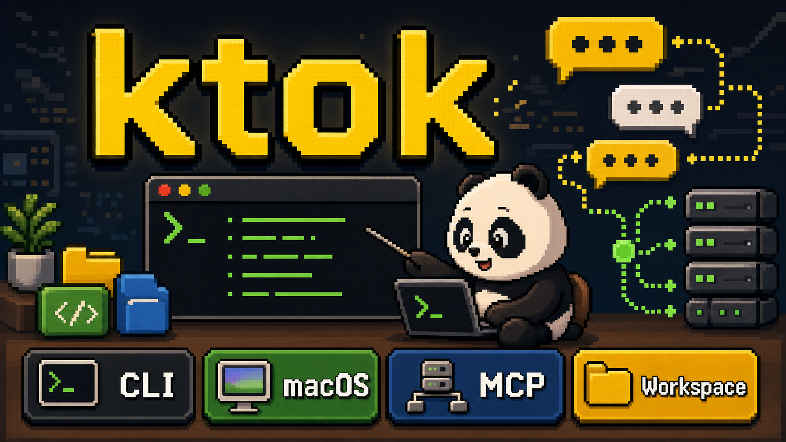

# ktok



`ktok` is a KakaoTalk macOS automation CLI, MCP server, and shared local workspace owner.

`ktok` remains the KakaoTalk I/O layer: it observes messages/attachments, sends messages/files, downloads attachments, and imports raw history. It also owns the canonical local data workspace at `KTOK_HOME` or `~/.ktok` so other local services can store and read shared KakaoTalk-related inputs, events, and files without a language SDK.

## Quick Start

```bash
swift build
ktok status
ktok login work
ktok chats --json
ktok read "채팅방" --json
ktok watch "채팅방" --json
ktok monitor "채팅방" --persona luna
ktok inputs save-text --account work --source my-service --text "hello" --json
ktok inputs save-file --account work --source my-service /path/to/file.pdf --json
ktok storage paths --account work --chat "채팅방" --json
ktok mcp-server
```

`read --json` keeps the existing `messages` array and includes visible attachment candidates:

```json
{
  "chat": "채팅방",
  "fetched_at": "2026-05-29T10:00:00.000Z",
  "count": 1,
  "messages": [
    {"author": "홍길동", "time_raw": "10:00", "body": "확인 부탁드립니다"}
  ],
  "attachments": [
    {
      "attachment_id": "att_0123456789abcdef",
      "chat": "채팅방",
      "filename": "report.pdf",
      "candidate_value": "report.pdf",
      "author": "홍길동",
      "time_raw": "10:00",
      "row_index": 42,
      "reason": "extension"
    }
  ]
}
```

By default, `read` and `watch` also record observed message/attachment events into the shared workspace. Use `--no-record-events` to disable recording for a run.

`monitor` opens one room once, keeps watching that fixed room, and replies only when the configured persona should respond:

```bash
ktok assume work
ktok monitor "AgentKorea 운영진" --persona luna
```

The `luna` persona replies to direct calls such as `루나` or `비서야`, general greetings, and warm-empathy cues. It does not treat `아나벨` or `허동호` as Luna. Monitor state is kept in the active account SQLite database under `~/.ktok/accounts/<alias>/history.sqlite`.

If monitor read recovery fails repeatedly, it logs the failed phase and restarts itself with the same arguments. Use `--restart-after-read-failures 0` only when you want to disable that recovery behavior.

## Shared Workspace

The storage root is `KTOK_HOME` when set, otherwise `~/.ktok`.

```text
~/.ktok/
  .gitignore
  README.md
  config/
  state/
    current-account.json
  accounts/
    <alias>/
      account.json
      rooms.json
      history.sqlite
      events/
        yyyy-mm-dd.jsonl
      inputs/
        text/yyyy-mm-dd/<input_id>.json
        files/yyyy-mm-dd/<input_id>/original.*
        files/yyyy-mm-dd/<input_id>/metadata.json
      rooms/
        <chat_id>/
          events/yyyy-mm-dd.jsonl
          attachments/<attachment_id>/metadata.json
          attachments/<attachment_id>/original.*
      downloads/
      exports/
      jobs/
  cache/
    ax-cache.json
  logs/
```

Workspace rules:

- `~/.ktok` is the canonical local workspace shared by ktok and local services.
- Services should write shared data through `ktok storage`, `ktok events`, and `ktok inputs` first.
- Direct file writes are allowed only if they follow the Dev Guide atomic-write and JSONL lock rules.
- Secrets do not go in `~/.ktok`; login passwords stay in Keychain or the platform secret backend.
- `history.sqlite` remains the raw search DB populated by `sync-history` and `import-history`.

Default `.gitignore` inside `~/.ktok` is local-first:

```gitignore
*
!.gitignore
!README.md
!config/
!config/.gitkeep
```

## Workspace CLI

```bash
ktok storage paths --json
ktok storage paths --account work --chat "채팅방" --json
ktok storage validate --json
ktok events append --account work --type message --json-file event.json --json
ktok inputs save-text --account work --source service --text "hello" --json
ktok inputs save-file --account work --source service /path/to/file.pdf --json
```

Write commands create parent directories, use atomic file writes, and append JSONL events under a file lock. JSON output includes `id`, `account_alias`, `chat_id`, `path`, `event_path`, `event_paths`, and `created_at`.

## Login Model

```bash
scripts/setup-login-env.sh --alias work
ktok login work
ktok login private --trust-state
ktok assume work
ktok whoami --json
ktok logout
```

`scripts/setup-login-env.sh` writes non-secret login settings to `~/.ktok/config/.env`, removes any plaintext password entry for that alias, and stores the password in the platform secret backend. `ktok login <alias>` reads the account ID from env or `.env`, reads the password from env or the secret backend, logs into KakaoTalk, and writes account metadata/state.

- macOS: Keychain service `ktok`, account `login:<alias>`.
- Windows port recommendation: Windows Credential Manager target `ktok/login/<alias>`.
- Linux port recommendation: Secret Service/libsecret.

If the user manually switches KakaoTalk accounts, run `ktok whoami` or `ktok assume <alias>` before account-scoped writes.

## MCP

Run:

```bash
ktok mcp-server
```

The MCP server exposes 12 tools:

| Tool | Purpose |
| --- | --- |
| `ktok_read` | Read visible messages and attachment candidates |
| `ktok_send` | Send a text message |
| `ktok_send_image` | Send an image |
| `ktok_send_file` | Send a file |
| `ktok_download_file` | Download an attachment by `attachment_id` or `filename` |
| `ktok_sync_history` | Export/import a full chat CSV into raw history DB |
| `ktok_import_history` | Import an existing KakaoTalk CSV |
| `ktok_query_history` | Query raw history DB |
| `ktok_storage_paths` | Resolve shared workspace paths |
| `ktok_inputs_save_text` | Save user text input into `~/.ktok` |
| `ktok_inputs_save_file` | Save user file input into `~/.ktok` |
| `ktok_events_append` | Append a shared workspace event |

`ktok watch --json` is intentionally managed as a CLI subprocess because it is a long-running stream.

## Documentation

- [docs/CLI.md](docs/CLI.md): complete CLI reference.
- [docs/DEV_GUIDE.md](docs/DEV_GUIDE.md): shared workspace rules for other services.
- [docs/SERVICE_INTEGRATION.md](docs/SERVICE_INTEGRATION.md): compatibility pointer to the Dev Guide.

## Development Checks

```bash
swift build
swift build -c release
git diff --check
KTOK_HOME=/tmp/ktok-home-test ktok storage paths --json
KTOK_HOME=/tmp/ktok-home-test ktok inputs save-text --account work --source test --text "hello" --json
```
